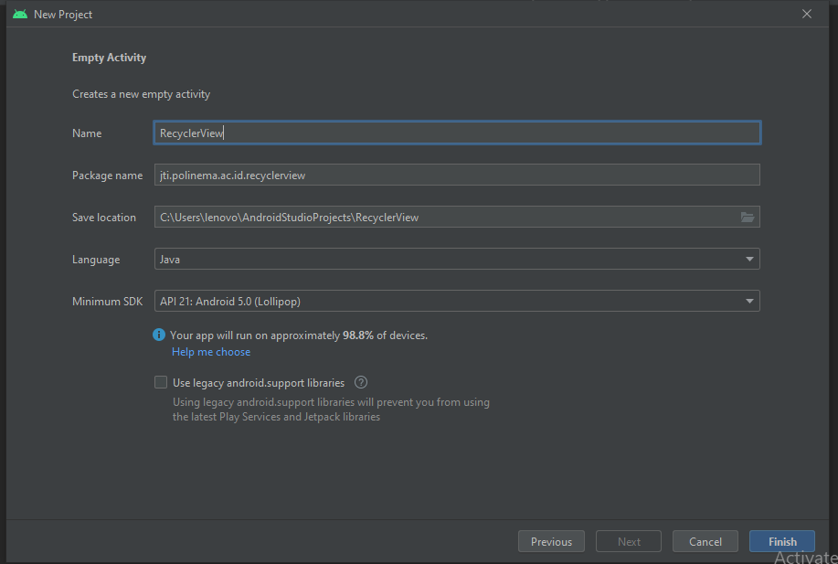

# JOBSHEET 04 RECYCLER VIEW ANDROID STUDIO
1. Membuat project baru dan memilih empty activity 
  
  
2. Membuat depedencies  
  
Selanjutnya pada file xml di layout activity akan otomatis muncul code seperti dibawah  
  
3. Lalu buat class java dengan nama Model  
  
dan isi dengan code program seperti dibawah  
  
4. Lalu buat layout baru dengan nama list  
  
  
lalu isikan kode program seperti dibawah  
  
5. Lalu buat class java dengan nama adapter  
  
dan isikan kode program seperti dibawah  
  
6. Lalu buat class java dengan nama Data  
  
dan isikan kode program seperti dibawah  
  
7. Lalu pada main activity isikan kode program seperti gambar dibawah  
  
8. HASIL APLIKASI  
  

